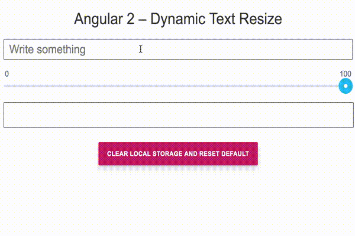

# Angular 2 – Dynamic Text Resize 
## Demo




## Description

This application is a Angular 2 app with:
- An input text field
- A slider
- An output div
- A reset button

The input text field value will be displayed in the output div. The slider allows to change the side of the output div. The reset button is for cleaning the localstorage content.

Basically, text entered in the input will fit in the output container *no matter what*. This container can be resized, the text can be very long, the app compute the optimal font size so that this text will fit in the container.

## Going further

We could work on the following things to improve this app:
- Improve testing in general. Some comportements are not tested (like slider's behavior). We should cover all cases.
- Add a slider to change the height of the output div. Thus, we would be able to create a fully configurable container so that the text will be able to fit perfectly in both width/height.
- Package our project *as a web component* so that we would be able to use easily it in other projects. 

## Prerequisites & dependencies

```
Docker
npm >= 6.0
@angular/cli >= 6.1.2
```

## Quickstart

You can simply start and run the project with:

```
git clone https://github.com/epsxy/angular2-dynamic-text-resize
cd angular2-dynamic-text-resize
npm run quickstart
```

The application will be available at `localhost:4242`

NB: The previous command will:
- Clone the repo
- Install node dependencies
- Build docker image
- Run docker image
- Run the angular app on host port 4242

## Install

2 types of install are supported: 
- Host: Clone the repository, install dependencies and run the application
- Docker: Use provided scripts to build and run the project inside a docker container

### Host

- Clone the repo: `git clone https://github.com/epsxy/angular2-dynamic-text-resize`
- Install node dependencies: `npm install`
- Run the project on your host: `npm run start`

The application will be available at `localhost:4200`

### Docker

- Clone the repo: `git clone https://github.com/epsxy/angular2-dynamic-text-resize`
- Install node dependencies: `npm install`
- Build docker container: `npm run docker:build`
- [Optional] Check docker if docker image has been successfully built: `npm run docker:check` should return 1
- Run project in docker: `npm run docker:serve`

The application will be available at `localhost:4242`

## Tests

Tests can be runned in your host or in a docker container.

### Host

- Lint: `npm run lint`
- Unit tests: `npm run test`
- End to end tests: `npm run e2e`

### Docker

This will run lint, unit and end-to-end tests.

```
npm run docker:test
```

## Continuous Integration

This project has got a [CI branch on Travis](https://travis-ci.org/epsxy/angular2-dynamic-text-resize).

## ISSUES

### Application

- *Issue for lower bound text fitting*. When the text is big enough, or the output box is small enough, new font size could not be computed. As we are considering integer font sizes, when a 1px sized text does not fit in the container, the new computed font needs to be 0px. Which is not suitable for this app. When this situation happens, the data is reset in the app: input is cleared and slider value returns to 100%.

## MISC

This project was generated with [Angular CLI](https://github.com/angular/angular-cli) version 6.1.2.
